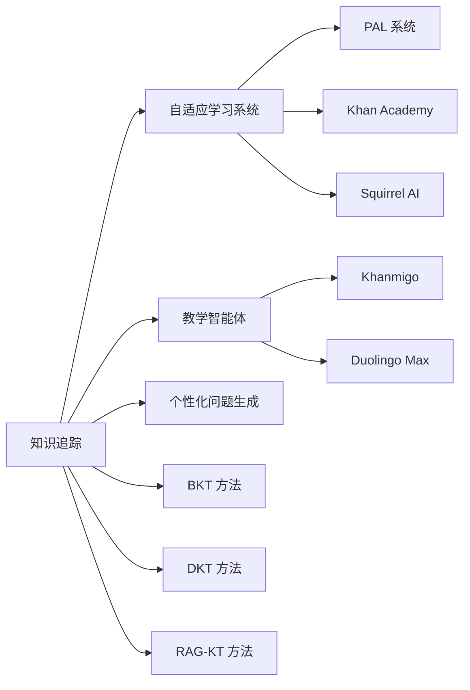

<div align="center">

# 🧠 AI in Education Wiki

### **AI+教育 前沿进展 · 研究论文 · 产品应用 · 政策与伦理**

[](https://nextjs.org/)
[](https://www.typescriptlang.org/)
[](https://tailwindcss.com/)
[](https://vercel.com)
[](LICENSE)

**一个系统化、结构化、可交互的 AI 教育领域知识库**

[🚀 在线访问](https://ai-edu-wiki.vercel.app) · [📖 贡献指南](#-如何贡献) · [🗺️ 知识图谱](#-知识图谱)

</div>

---

## 📊 项目规模

<div align="center">

| 指标 | 数量 | 说明 |
|:----:|:----:|:-----|
| 📄 **总页面数** | **67** | 持续增长中 |
| 📚 **论文摘要** | 25 | 来自 arXiv 的最新研究 |
| 💡 **核心概念** | 22 | AI 教育领域关键概念 |
| 🏢 **实体页面** | 27 | 公司、产品、研究者、机构 |
| ⚖️ **对比分析** | 4 | 多维度横向对比 |
| 🔥 **争议话题** | 3 | 学术争议与开放问题 |
| 📅 **时间线** | 9 | 年度总览 + 主题专题 |
| 📝 **教程指南** | 2 | 博客风格入门教程 |
| 🕸️ **知识图谱** | 59 节点 · 27 边 | 交互式可视化 |

</div>

---

## 🌟 这是什么？

想象一下，你正在研究 **AI+教育** 这个快速发展的领域。你需要：

- 📖 理解 **知识追踪** 是什么，有哪些主流方法
- 🏢 知道 **Khanmigo** 和 **Duolingo Max** 有什么区别
- 👨‍🔬 找到 **Chris Piech** 和 **Kenneth Koedinger** 的研究方向
- ⚖️ 比较 **BKT、DKT、RAG-KT** 三种知识追踪方法的优劣
- 🔥 了解 **AI 是否应该替代教师** 的争议各方观点
- 📅 追踪 **2020-2026 年** AI 教育领域的发展脉络

**这个 Wiki 就是为你准备的。**

它不是一个简单的文档集合，而是一个 **活的知识网络**——每个概念、实体、论文之间通过 wikilinks 相互连接，形成一张不断生长的知识图谱。

---

## ✨ 功能特性

- 🔍 **⌘K 搜索** — 中英文模糊搜索，即时结果
- 🕸️ **交互式知识图谱** — 力导向图可视化，点击导航，按类型筛选
- 👤 **GitHub 登录** — OAuth 认证，收藏页面
- 💬 **Giscus 评论** — 基于 GitHub Discussions 的评论系统
- 📊 **数据仪表盘** — 统计卡片、分类入口、最新更新
- 🌙 **暗色模式** — 浅色/暗色主题切换
- 📱 **响应式设计** — 移动端完美适配

---

## 🏗️ 项目结构

```
AIEduWiki/
├── content/                    # MDX 内容
│   ├── theory/                 # 学习理论（19 页）
│   ├── technology/             # 技术方法（5 页）
│   ├── products/               # 产品与公司（27 页）
│   ├── insights/               # 争议与趋势（16 页）
│   ├── SCHEMA.md               # 内容规范
│   └── index.json              # 内容索引
│
├── src/
│   ├── app/                    # Next.js App Router 页面
│   │   ├── page.tsx            # 首页 Dashboard
│   │   ├── [domain]/[slug]/   # 动态内容页面
│   │   ├── graph/              # 知识图谱页面
│   │   ├── search/             # 搜索页面
│   │   └── api/auth/           # NextAuth API
│   ├── components/
│   │   ├── ui/                 # shadcn/ui 基础组件（11 个）
│   │   ├── layout/             # 布局组件（导航、侧边栏、TOC）
│   │   ├── content/            # 内容组件（WikiLink、Admonition、DataTable）
│   │   ├── search/             # 搜索组件（⌘K 命令面板）
│   │   ├── graph/              # 知识图谱组件（react-force-graph）
│   │   ├── dashboard/          # 首页 Dashboard 组件
│   │   └── user/               # 用户系统组件
│   ├── lib/
│   │   ├── mdx.ts              # MDX 编译管道
│   │   ├── remark-wikilinks.ts # Wikilink remark 插件
│   │   ├── remark-admonitions.ts
│   │   ├── auth.ts             # NextAuth 配置
│   │   └── search.ts           # Fuse.js 搜索
│   └── styles/globals.css      # Tailwind + 设计系统
│
├── scripts/
│   ├── build-graph.mjs         # 图谱数据生成
│   ├── build-search-index.mjs  # 搜索索引生成
│   ├── migrate-to-mdx.mjs      # 内容迁移脚本
│   ├── agent_fetch.py          # AI Agent 论文抓取
│   ├── agent_generate.py       # 论文→页面生成
│   └── agent_update_index.py   # 索引更新
│
├── public/
│   ├── graph.json              # 图谱数据
│   └── search-index.json       # 搜索索引
│
├── wiki/                       # 旧 MkDocs 内容（存档）
├── package.json
├── next.config.mjs
├── tailwind.config.ts
└── tsconfig.json
```

---

## 🕸️ 知识图谱

<div align="center">

**59 个节点 · 27 条边 · 7 种节点类型**

</div>

每个页面都是知识图谱中的一个节点，通过 wikilinks 相互连接：



**节点类型**：
- 🔵 **概念** (蓝色) — 核心概念和主题
- 🟢 **实体** (绿色) — 公司、产品、研究者、机构
- ⚫ **论文** (灰色) — 原始研究论文
- 🟠 **时间线** (橙色) — 年度和主题时间线
- 🟣 **教程** (紫色) — 入门教程和指南
- 🔴 **对比** (红色) — 多维度横向对比
- 🩷 **争议** (粉色) — 学术争议与开放问题

---

## 🤖 AI Agent 工作流

这个 Wiki 配备了 AI Agent，可以自动完成论文抓取和页面生成：

### 使用方式

```bash
# 1. 抓取最近 7 天的 AI 教育论文
python scripts/agent_fetch.py --days 7 --output .omc/papers.json

# 2. 生成 Wiki 页面草稿（输出到 content/ 目录）
python scripts/agent_generate.py --input .omc/papers.json

# 3. 重新生成图谱和搜索索引
npm run build
```

### 在 Claude Code 中使用

直接对话即可：

> "帮我抓取最近一周的 AI 教育论文"

Agent 会自动：
1. 🔍 搜索 arXiv API
2. 📝 生成论文草稿（含分级）
3. 💾 写入 `content/` 目录
4. 📊 重新构建图谱和搜索索引

### 论文分级机制

| 级别 | 标准 | 处理方式 |
|:----:|:-----|:---------|
| ⭐ **核心论文** | 综述/框架、跨领域、有 DOI | 深度解读：方法论、实验、结果、局限性 |
| 📄 **普通论文** | 增量改进、单一应用 | 简要摘要：核心贡献、局限性 |

---

## 🕐 时间线概览

```
2020 ──── COVID-19 催化在线教育爆发
  │       GPT-3 发布，LLM 进入教育视野
  │
2021 ──── LLM 产品化开始
  │       Duolingo 推出 AI 功能
  │
2022 ──── ChatGPT 震撼教育界
  │       学术诚信危机爆发
  │
2023 ──── 教育 AI 产品爆发
  │       Khanmigo、Duolingo Max 发布
  │
2024 ──── 多智能体与个性化深度融合
  │       知识图谱+LLM 结合
  │
2025 ──── 可解释 AI 教育成为焦点
  │       全球治理框架讨论
  │
2026 ──── 多智能体协作、可解释性、
          个性化生成、公平性审计
          四大主线并行发展
```

---

## 🚀 快速开始

### 环境要求

- Node.js 18+
- npm 或 yarn 或 pnpm

### 本地运行

```bash
# 1. 克隆仓库
git clone https://github.com/lzytttttt/AIEduWiki.git
cd AIEduWiki

# 2. 安装依赖
npm install

# 3. 本地开发
npm run dev

# 4. 访问 http://localhost:3000
```

### 构建部署

```bash
# 构建（自动生成图谱和搜索索引）
npm run build

# 部署到 Vercel
# 自动部署：推送到 main 分支即可
```

### 环境变量

在 Vercel Dashboard 或 `.env.local` 中配置：

```env
GITHUB_ID=          # GitHub OAuth App ID
GITHUB_SECRET=      # GitHub OAuth App Secret
NEXTAUTH_SECRET=    # NextAuth 加密密钥
NEXTAUTH_URL=       # 站点 URL (https://ai-edu-wiki.vercel.app)
```

---

## 📖 如何贡献

### 添加新论文

1. 运行 `python scripts/agent_fetch.py` 抓取论文
2. 运行 `python scripts/agent_generate.py` 生成页面草稿
3. 审核草稿内容，补充核心贡献和局限性
4. 运行 `npm run build` 重新生成图谱和搜索索引
5. 提交 PR

### 添加新概念

1. 在 `content/theory/` 或 `content/technology/` 创建 `.mdx` 文件
2. 使用标准 frontmatter 格式
3. 与现有页面建立 `[[wikilink]]` 互链
4. 运行 `npm run build` 确认构建成功

### 添加新实体

1. 在 `content/products/` 创建 `.mdx` 文件
2. 包含：概述、关键事实、AI 教育应用、与其他实体的关系、sources
3. 与现有页面建立 `[[wikilink]]` 互链

### 质量检查

```bash
# TypeScript 类型检查
npx tsc --noEmit

# 构建验证
npm run build

# Python 质量审核
python scripts/lint.py
```

---

## 🛠️ 技术栈

| 技术 | 用途 | 说明 |
|:-----|:-----|:-----|
| [Next.js 14](https://nextjs.org/) | 前端框架 | App Router、SSG、API Routes |
| [TypeScript](https://www.typescriptlang.org/) | 类型安全 | 全项目 TypeScript |
| [Tailwind CSS](https://tailwindcss.com/) | 样式系统 | 实用优先的 CSS 框架 |
| [shadcn/ui](https://ui.shadcn.com/) | 组件库 | 可定制的 React 组件 |
| [MDX](https://mdxjs.com/) | 内容格式 | Markdown + JSX |
| [react-force-graph](https://github.com/vasturiano/react-force-graph) | 知识图谱 | 交互式力导向图 |
| [Fuse.js](https://www.fusejs.io/) | 搜索引擎 | 中英文模糊搜索 |
| [NextAuth.js](https://next-auth.js.org/) | 用户认证 | GitHub OAuth |
| [Giscus](https://giscus.app/) | 评论系统 | 基于 GitHub Discussions |
| [Vercel](https://vercel.com) | 部署平台 | 自动部署、CDN 加速 |
| [Python](https://www.python.org/) | Agent 脚本 | 论文抓取、质量审核 |
| [arXiv API](https://arxiv.org/help/api) | 论文数据源 | 自动抓取最新论文 |

---

## 📊 项目统计

<div align="center">


</div>

---

## 🤝 社区

- 📧 **反馈**：[GitHub Issues](https://github.com/lzytttttt/AIEduWiki/issues)
- 💬 **讨论**：[GitHub Discussions](https://github.com/lzytttttt/AIEduWiki/discussions)
- 📖 **文档**：[在线 Wiki](https://ai-edu-wiki.vercel.app)

---

## 📄 许可证

本项目采用 [MIT 许可证](LICENSE) 开源。

---

<div align="center">

**🧠 让 AI 教育知识触手可及**

*Built with ❤️ for the AI+Education community*

</div>
